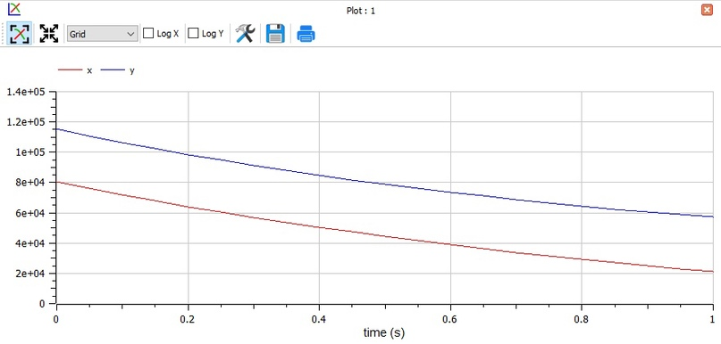
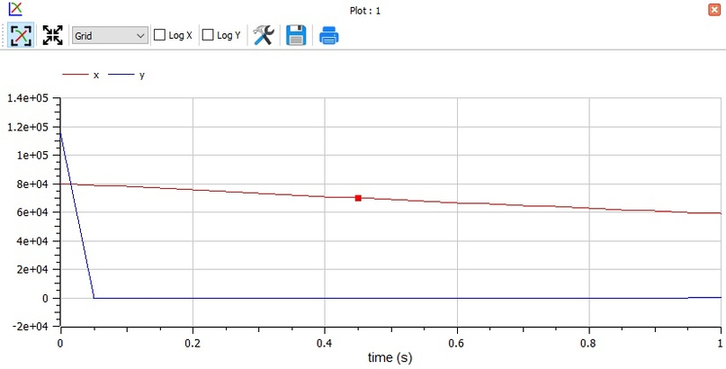

---
# Front matter
lang: ru-RU
title: Защита лабораторной работы №3. Моделирование боевых действий
author: "Бурдина Ксения Павловна"
group: NFIbd-01-19
institute: RUDN University, Moscow, Russian Federation
date: 2022 Feb 24th

# Formatting
toc: false
slide_level: 2
header-includes: 
 - \metroset{progressbar=frametitle,sectionpage=progressbar,numbering=fraction}
 - '\makeatletter'
 - '\beamer@ignorenonframefalse'
 - '\makeatother'
aspectratio: 43
section-titles: true
theme: metropolis

---

# Результат выполнения лабораторной работы №3

# Цель выполнения лабораторной работы 

Необходимо научиться выполнять построение математической модели боевых действий для решения задачи об изменении численности армий. Нужно рассмотреть задачу боевых действиях войск и отрядов в процессе войны между двумя государствами.

# Задачи выполнения лабораторной работы

1. Провести рассуждения и записать дифференциальные уравнения потери численностей войск;

2. Построить график модели боевых действий, отображающий потери численности войск при боевых действиях между регулярными войсками;

3. Построить график модели боевых действий, отображающий потери численности войск при боевых действиях с участием регулярных войск и партизанских отрядов.

# Уравнения

Общее уравнение для случая 1:
$$\frac{dx}{dt} = -0.3x(t)-0.56y(t)+sin(t+10)$$
$$\frac{dy}{dt} = -0.68x(t)-0.33y(t)+cos(t+10)$$

Общее уравнение для случая 2:
$$\frac{dx}{dt} = -0.31x(t)-0.77y(t)+sin(2t+10)$$
$$\frac{dy}{dt} = -0.67x(t)y(t)-0.51y(t)+cos(t+10)$$

Начальные условия:
$$x_0 = 80000$$
$$y_0 = 115000$$

# Результат выполнения лабораторной работы

Модель ведения боевых действий между регулярными войсками

# Результат выполнения лабораторной работы

Модель ведения боевых действий с участием регулярных войск и партизанских отрядов

# Выводы

- провели рассуждения и выполнили построение математической модели для решения задачи о потере на примере задачи о боевых действиях между двумя государствами;

-  получили дифференциальные уравнения, на основе которых решили задачу о потерях;

- построили графики потерь армий для каждого представленного случая.

