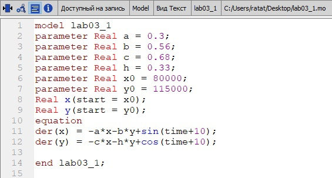
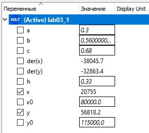
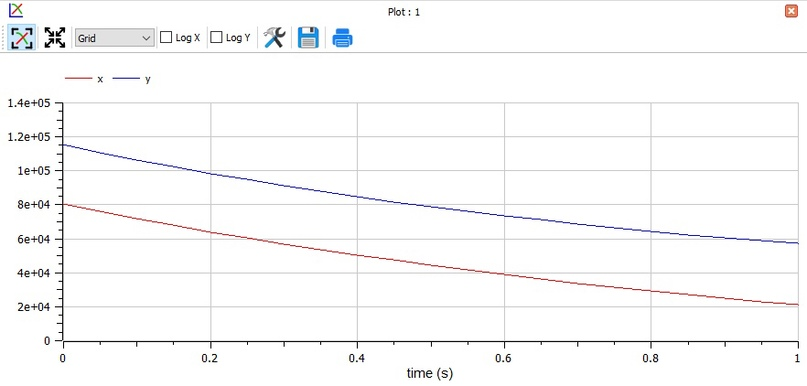
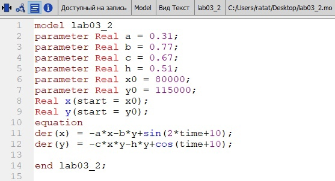
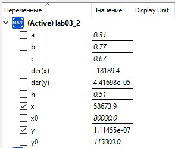
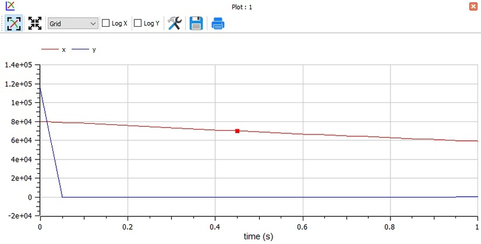

---
# Front matter
title: "Отчет по лабораторной работе №3"
subtitle: "Модель боевых действий"
author: "Бурдина Ксения Павловна"
group: NFIbd-01-19
institute: RUDN University, Moscow, Russian Federation
date: 2022 Feb 24th

# Generic otions
lang: ru-RU
toc-title: "Содержание"

# Bibliography
csl: pandoc/csl/gost-r-7-0-5-2008-numeric.csl

# Pdf output format
toc: true # Table of contents
toc_depth: 2
lof: true # List of figures
lot: true # List of tables
fontsize: 12pt
linestretch: 1.5
papersize: a4
documentclass: scrreprt
### Fonts
mainfont: PT Serif
romanfont: PT Serif
sansfont: PT Sans
monofont: PT Mono
mainfontoptions: Ligatures=TeX
romanfontoptions: Ligatures=TeX
sansfontoptions: Ligatures=TeX,Scale=MatchLowercase
monofontoptions: Scale=MatchLowercase,Scale=0.9
## Biblatex
biblatex: true
biblio-style: "gost-numeric"
biblatexoptions:
  - parentracker=true
  - backend=biber
  - hyperref=auto
  - language=auto
  - autolang=other*
  - citestyle=gost-numeric
## Misc options
indent: true
header-includes:
  - \linepenalty=10 # the penalty added to the badness of each line within a paragraph (no associated penalty node) Increasing the value makes tex try to have fewer lines in the paragraph.
  - \interlinepenalty=0 # value of the penalty (node) added after each line of a paragraph.
  - \hyphenpenalty=50 # the penalty for line breaking at an automatically inserted hyphen
  - \exhyphenpenalty=50 # the penalty for line breaking at an explicit hyphen
  - \binoppenalty=700 # the penalty for breaking a line at a binary operator
  - \relpenalty=500 # the penalty for breaking a line at a relation
  - \clubpenalty=150 # extra penalty for breaking after first line of a paragraph
  - \widowpenalty=150 # extra penalty for breaking before last line of a paragraph
  - \displaywidowpenalty=50 # extra penalty for breaking before last line before a display math
  - \brokenpenalty=100 # extra penalty for page breaking after a hyphenated line
  - \predisplaypenalty=10000 # penalty for breaking before a display
  - \postdisplaypenalty=0 # penalty for breaking after a display
  - \floatingpenalty = 20000 # penalty for splitting an insertion (can only be split footnote in standard LaTeX)
  - \raggedbottom # or \flushbottom
  - \usepackage{float} # keep figures where there are in the text
  - \floatplacement{figure}{H} # keep figures where there are in the text
---

# Цель работы

Целью данной работы является построение математической модели боевых действий - модели Ланчестера на примере задачи о боевых действиях войск и отрядов в процессе войны между двумя государствами.

# Задание

В ходе работы необходимо:

1. Прописать уравнения для построения моделей боевых действий с учетом потерь, не связанных с боевыми действиями, и потерь, произошедших на поле боя, при условии, что численность армии страны $X$ в начале войны составляет $80 000$ человек, а численность армии страны $Y$ - $115 000$ человек.

2. Построить график для модели боевых действий между регулярными войсками.

3. Построить график для модели боевых действий с участием регулярных войск и партизанских отрядов.

# Теоретическое введение

Постановка задачи следующая:

Между страной $X$ и страной $Y$ идет война. Численность состава войск исчисляется от начала войны и являются временными функциями $x(t)$ и $y(t)$. В начальный момент времени страна $X$ имеет армию численностью $80 000$ человек, а в распоряжении страны $Y$ армия численностью в $115 000$ человек. Для упрощения модели считаем, что коэффициенты $a, b, c, h$ постоянны. Также считаем $P(t)$ и $Q(t)$ непрерывными функциями.

Решение исходной задачи сводится к решению системы из двух дифференциальных уравнений: 

$$ \left\{ 
\begin{array}{c}
\frac{dx}{dt} = -0.3x(t)-0.56y(t)+sin(t+10) \\ 
\frac{dy}{dt} = -0.68x(t)-0.33y(t)+cos(t+10) \\ 
\end{array}
\right.$$

в первом случае и

$$ \left\{ 
\begin{array}{c}
\frac{dx}{dt} = -0.31x(t)-0.77y(t)+sin(2t+10) \\ 
\frac{dy}{dt} = -0.67x(t)y(t)-0.51y(t)+cos(t+10) \\ 
\end{array}
\right.$$

во втором, с начальными условиями: 

$$ \left\{ 
\begin{array}{c}
x_0 = 80000 \\ 
y_0 = 115000 \\ 
\end{array}
\right.$$

# Выполнение лабораторной работы

1. Принимаем за $X_0 = 80000$, $y_0 = 115000$ - численность войск на момент начала боевых действий.

2. Рассмотрим возможные варианты развития войны для случаев, когда боевые действия происходят между регулярными войсками, а также когда боевые действия происходят с участием регулярных войск и партизанских отрядов.

3. Заметим, что в первом случае, когда боевые действия идут только между регулярными войсками, численность каждой армии зависит от следующих факторов:
1) Скорость уменьшения численности войск из-за причин, не связанных с боевыми действиями. Здесь потери описывают члены $-a(t)x(t)$ и $-h(t)y(t)$, где $a(t), h(t)$ - величины, характеризующие степень слияния различных факторов на потери.
2) Скорость потерь, обусловленных боевыми действиями противоборствующих сторон. Потери на поле боя в данном случае отражают члены $-b(t)y(t)$ и $-c(t)x(t)$, где коэффициенты $b(t)$ и $c(t)$ указывают на эффективность боевых действий со стороны $y$ и $x$ соответственно.
3) Скорость поступления подкрепления. Она задается некоторыми функциями $P(t), Q(t)$, которые учитывают возможность подхода подкрепления к войскам $X$ и $Y$ в течение одного дня.

4. Получаем, что в первом случае модель боевых действий описывается следующим образом:

$\frac{dx}{dt} = -a(t)x(t)-b(t)y(t)+P(t) \\$
$\frac{dy}{dt} = -c(t)x(t)-h(t)y(t)+Q(t) \\$ 

5. Во втором случае в борьбу добавляются партизанские отряды. Нерегулярные войска в отличие от постоянной армии менее уязвимы, так как действуют скрытно, в этом случае сопернику приходится действовать неизбирательно, по площадям, занимаемым партизанами. Поэтому считается, что теперь потери партизан, проводящих свои операции в разных местах на некоторой неизвестной территории, пропорционален не только численности армейских соединений, но и численности самих партизан. Учитывая, что все коэффициенты имеют то же значение, что и в первом случае, получаем следующую модель боевых действий:

$\frac{dx}{dt} = -a(t)x(t)-b(t)y(t)+P(t) \\$
$\frac{dy}{dt} = -c(t)x(t)y(t)-h(t)y(t)+Q(t) \\$ 

6. Решение исходной задачи сводится к решению системы из двух дифференциальных уравнений с начальными условиями. Мы будем решать задачу для двух случаев.

7. Напишем программу для расчёта траектории движения в OpenModelica. Зададим начальные значения для численности войск $x_0 = 80000$ и $y_0 = 115000$. Далее запишем коэффициенты для расчета скорости потери численности войск в первом случае: $a = 0.3, b = 0.56, c = 0.68, h = 0.33$. Установим, что переменные $x, y$ имеют начальные значения $x_0, y_0$ соответственно. Запишем уравнения, описывающие нашу модель для случая, когда боевые действия происходят между регулярными войсками:

$der(x) = -a*x-b*y+sin(time+10) \\$
$der(y) = -c*x-h*y+cos(time+10) \\$ 

В результате выполнения данной программы получаем следующий график модели боевых действий:

8. Напишем программу для расчёта траектории движения лдя второго случая. Начальные значения для численности войск остаются прежними. Коэффициенты для расчета скорости потери численности войск в данном случае будут следующими: $a = 0.31, b = 0.77, c = 0.67, h = 0.51$. Установим, что переменные $x, y$ имеют начальные значения $x_0, y_0$ соответственно. Запишем уравнения, описывающие нашу модель для случая, когда боевые действия происходят между регулярными войсками:

$der(x) = -a*x-b*y+sin(2*time+10) \\$
$der(y) = -c*x*y-h*y+cos(time+10) \\$ 

В результате выполнения данной программы получаем следующий график модели боевых действий:

# Выводы

В процессе выполнения работы мы построили математическую модель боевых действий - модель Ланчестера на примере задачи о боевых действиях войск и отрядов в процессе войны между двумя государствами. Мы записали дифференциальные уравнения, описывающие скорость потери численности войск для случая, когда боевые действия идут между регулярными войсками, а также для случая, когда боевые действия проходят с участием регулярных войск и партизанских отрядов, и построили графики потерь численности каждой армии в процессе боевых действий для этих двух случаев.

# Список литературы

1. Методические материалы курса "Математическое моделирование".

2. Шумов В. В., Корепанов В. О. "Математические модели боевых и военных действий". М: 2019, 26 с.